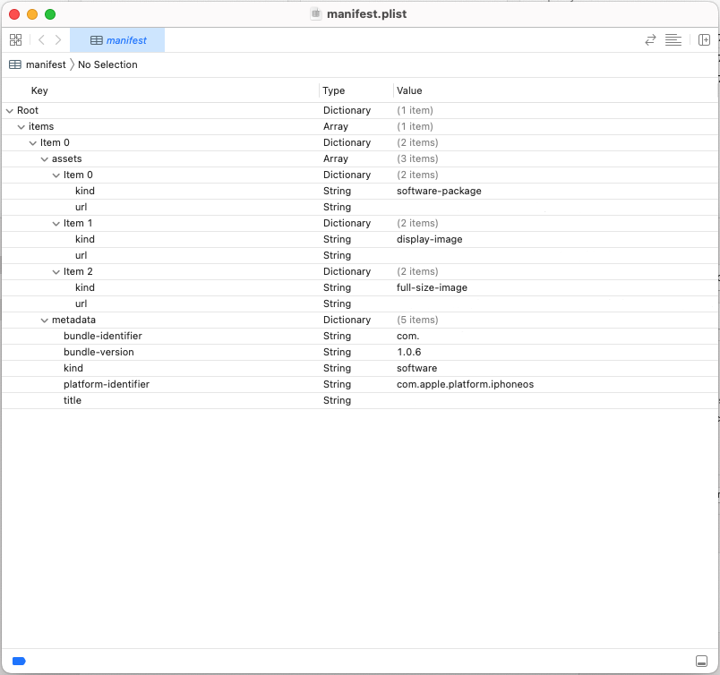

# lamp_remote_app

A new Flutter project.

## 앱 설치 방법

1.안드로이드 apk 파일

- apk 파일을 인터넷 서버에 업로드한다.
- 핸드폰에서 다운로드 받아 설치한다.
  -> 핸드폰설정 [알 수 없는 소스 설치] 체크 확인
- 웹에서 설치방법(서버 설정에 따라)
  <a href="https://서버주소/appname.apk" type="application/vnd.android.package-archive">App 다운로드</a>
  <a href="https://서버주소/appname.apk" >App 다운로드</a>

## 2.아이폰 ipa 파일

- 인터넷 서버에 아래 파일을 올린다.
  - iosinstall.html - 서버 접속 주소파일
  - kepco_o2.png, kepco_02.png - 앱아이콘파일
  - manifest.plist - 앱 설치 정보 파일(아이콘위치, ipa 파일 위치 로 변경 가능)
  - LampRemoteApp.ipa - 설치 파일
- https://서버주소/iosinstall.html 접속 (ssl이 인증된 주소)
- 인스톨 버튼 클릭하여 설치한다.

## Getting Started

# IOS 빌드 방법

https://temphi20.tistory.com/m/10

노상우 : 010-9915-7569

Archiving com.kepco.LampRemoteApp...
Automatically signing iOS for device deployment using specified development team in Xcode project: KQBV4TU5ZM
Running Xcode build...  
 └─Compiling, linking and signing... 4.8s
Xcode archive done. 56.4s
Built /Users/bk/work/app/lamp_remote_app/build/ios/archive/Runner.xcarchive.

p12인증서 + 비밀번호로 빌드하기

# 전범규 app dev 계정

tigerbk@kakao.com : 25/01/21 계정만료됨.

apk build에 이은 ipa build 정리.

apple developer 및 기기등록 등이 모두 되어있다고 가정하고 진행한다. (검색하면 많이 나온다.)

1. flutter build ipa
   반드시 xCode -> [Product] -> [Archive]가 아닌 flutter build ipa 명령어를 사용하여 Runner.xcarchive를 만든다. xCode로 빌드할 경우 이전 빌드 내역 그대로 빌드되니 주의하자.

2. Archives
   xCode -> [Window] -> [Organizer]로 들어가 Archives를 켠다. 생성된 Runner.xcarchive 파일을 실행하는 방법으로도 켜진다. Runner.xcarchive 파일을 실행하는 방법으로 켜면... 같은 Runner.xcarchive 파일이라도 Archives list에 중복으로 뜨니 이 점 주의.

Creation Date와 Version으로 build하고자 하는 archive가 맞는지 확인하고 선택한 후 [Distribute App]을 누른다.

3. Distribute App

- 추출 방법 선택: custom 선택 > release test용이라면 Ad Hoc을 선택한다.
  -> customn > Enterpase 선택하여 진행으로 변경(2025.10.23 기준)

- 옵션 선택: Include manifest for over-the-air installation를 반드시 선택해야 한다. App Thinning은 None으로 둬도 큰 문제가 없었다.

- manifest information: 이름과 3개의 url을 입력한다. url은 추후 변경이 가능하므로 아무거나 넣어도 상관 없다.

이후 서명까지 완료하면 자동으로 ipa가 추출된다.

4. 추출 후 배포
1. manifest.plist 파일을 수정한다. 형식은 아래와 같다.

item 0의 url은 ipa가 저장된 경로(후술), item 1과 item 2의 url은 앱 아이콘 이미지가 저장된 경로(후술).

ipa 및 이미지는 dropbox를 많이 이용한다. 추출한 ipa 파일(manifest.plist 파일과 같은 경로 혹은 Apps directory 아래에 있다.)과 이미지 파일을 dropbox에 저장한 후 그 링크를 사용하면 된다. 이때 dropbox link는 https://www.dropbox.com/s/...에서 https://dl.dropboxusercontent/s/...로 변경한다. 추후 html 파일에 사용할 link 역시 https://dl.dropboxusercontent/s/...로 변경하여 사용한다.

2. 수정한 manifest.plist를 dropbox에 올린다.

3. 아래와 같은 html 파일을 만든다. link를 이용하는 것이기 때문에 꼭 똑같이 할 필요는 없지 않을까 싶다.

<!doctype html>
<html lang="en">
 <head>
  <meta charset="UTF-8">
  <title>IPA 다운로드</title>
 </head>
 <body>
  <ul>
   <li><a href="itms-services://?action=download-manifest&url=https://dl.dropboxusercontent.com/s/.../manifest.plist">다운로드</a></li>
  </ul>
 </body>
</html>
html file에 들어가는 링크는 manifest.plist의 링크이다.

호스팅까지 완료하면 된다. dropbox에 html 파일을 올려도 되긴 한데, html 양식으로 보이지 않거나 링크 연결이 안 되는 문제가 생기기도 해서 페이지 하나 호스팅하는 쪽이 더 안정적이고 확실한 것 같다.

manifest.plist link를 이용하기 때문에, ipa 업데이트 시 html을 바꿀 필요 없이 dropbox에 같은 이름으로 업로드만 하면 된다. 만약 ipa url이 바뀐다면 manifest.plist만 수정해주면 왼다.

2025.02.03 external_app_launcher: ^4.0.1 업그레이드
kotlin 1.9 -> 2.0 업그레이드
jdk 11 -> 17 업그레이드
빌드그래들 버전 업그레이드

-- 슬플래쉬 화면 완전히 제거

- ProGuard 설정 추가

1. ProGuard 규칙 파일 생성 (proguard-rules.pro):

   - Flutter 관련 클래스 보호
   - Google Crypto Tink 경고 무시
   - WebView 관련 클래스 보호
   - missing_rules.txt의 모든 규칙 추가

   1. Google Play Core - 동적 모듈 설치 관련 클래스
   2. Google API Client - HTTP 통신 관련 클래스
   3. Joda Time - 시간 처리 라이브러리

2. build.gradle 수정:

   - Release 빌드에 minifyEnabled true 추가
   - ProGuard 파일 경로 지정
